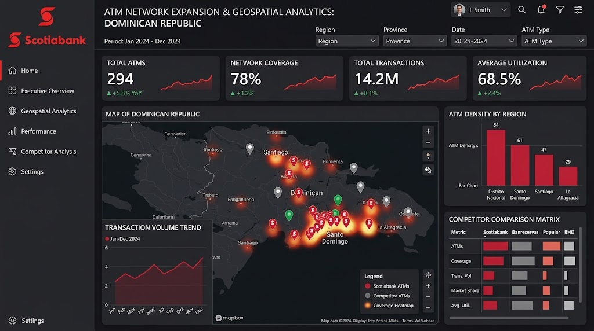

# ATM Network - Expansion & Analytics

This repository now has two versions:

- `v1`: simple Google Places API ingestion pipeline for Scotiabank ATMs, SQL storage, and Power BI dashboard guidance.
- `v2`: full FastAPI dashboard prototype with dark Scotia-style UI and geospatial analytics.

Start with `v1` when the goal is to collect data and build a Power BI report. Use `v2` when the goal is a custom web dashboard.

   
